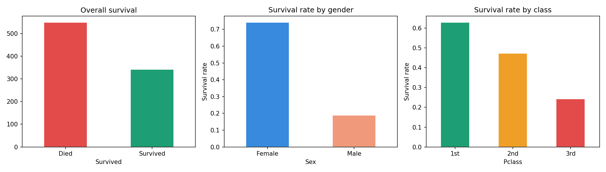
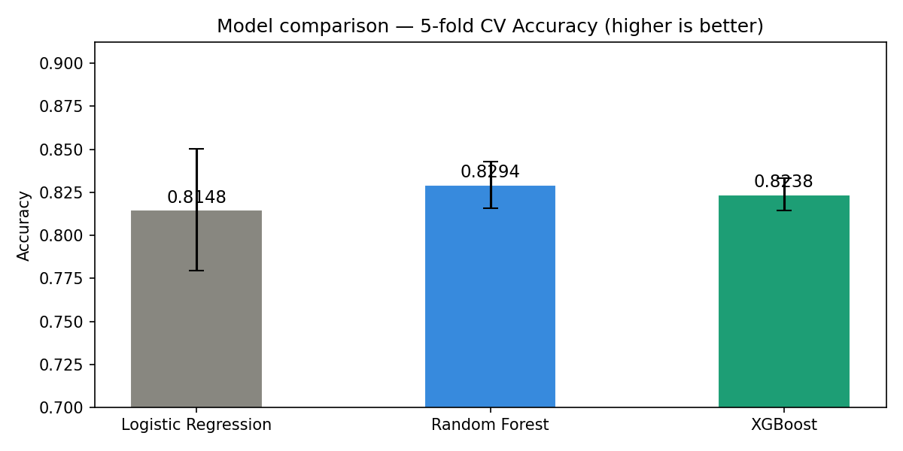
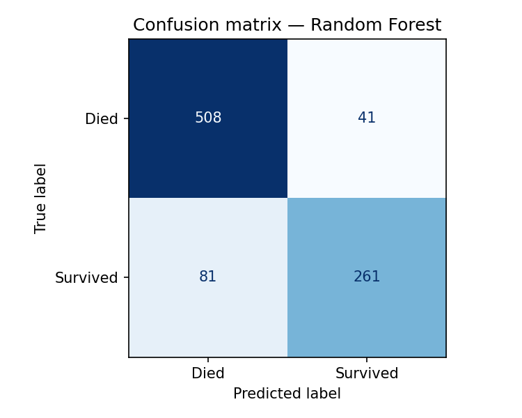
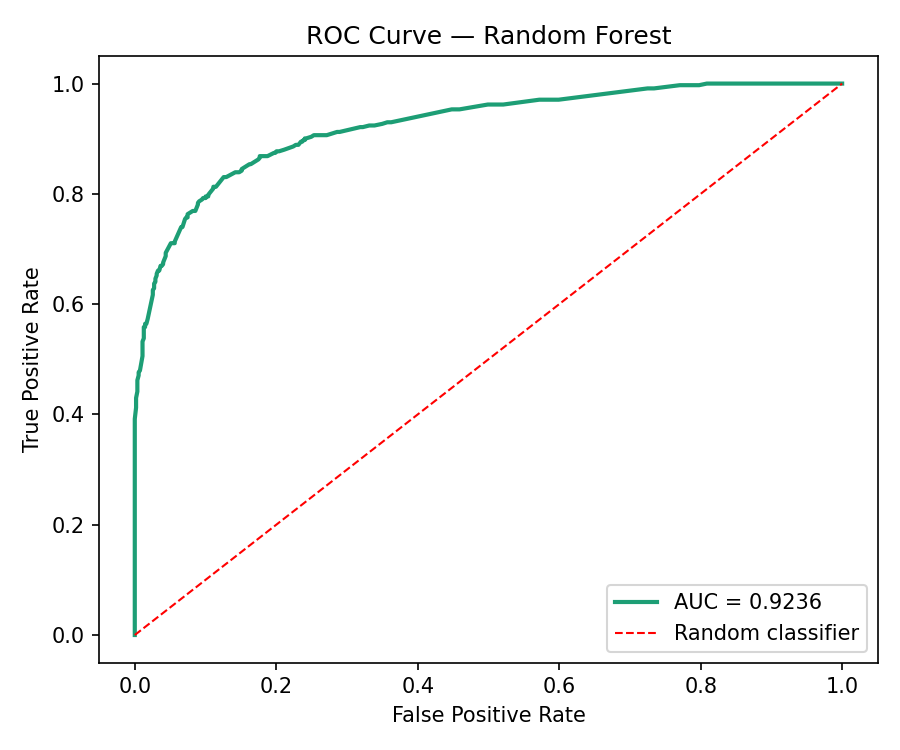
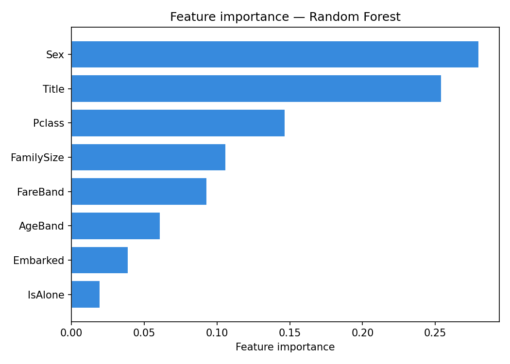
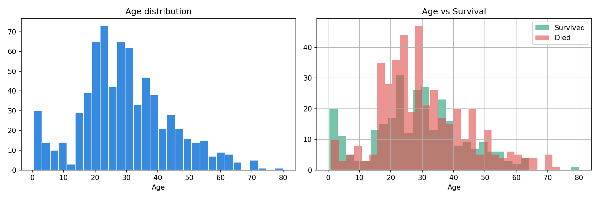

<div align="center">

# 🚢 Titanic Survival Prediction

### End-to-end classification pipeline on the Kaggle Titanic dataset

[](https://python.org)
[](https://scikit-learn.org)
[](https://xgboost.readthedocs.io)
[](https://www.kaggle.com/competitions/titanic)

</div>

---

## 📌 Overview

This project predicts passenger survival on the Titanic using the Kaggle dataset. The pipeline covers exploratory data analysis, missing value imputation, feature engineering (title extraction, family size, age/fare binning), and model training with **Logistic Regression**, **Random Forest**, and **XGBoost** using 5-fold cross-validation. Evaluation includes confusion matrix, ROC-AUC curve, and a final Kaggle submission file.

---

## 📁 Project Structure

```
titanic_survival_prediction/
│
├── 📂 data/
│   ├── train.csv               ← training data (891 rows, 12 features)
│   ├── test.csv                ← test data for Kaggle submission
│   └── submission.csv          ← final Kaggle submission file
│
├── 📓 titanic_survival_prediction.ipynb   ← main notebook
│
├── 📊 survival_overview.png
├── 📊 age_distribution.png
├── 📊 fare_distribution.png
├── 📊 correlation_heatmap.png
├── 📊 model_comparison.png
├── 📊 confusion_matrix.png
├── 📊 roc_curve.png
└── 📊 feature_importance.png
```

---

## 🔧 Pipeline

```
Raw Data  ──►  EDA & Cleaning  ──►  Feature Engineering  ──►  Model Training  ──►  Submission
              │                     │                          │
              ├─ Null imputation    ├─ Title extraction        ├─ Logistic Regression
              ├─ Drop Cabin         ├─ Family size             ├─ Random Forest
              └─ Encode features    ├─ Age / Fare binning      ├─ XGBoost
                                    └─ IsAlone flag            └─ 5-fold CV
```

---

## ✨ Feature Engineering Highlights

| Feature | Description |
|---|---|
| `Title` | Extracted from name (Mr, Mrs, Miss, Master, Rare) |
| `FamilySize` | SibSp + Parch + 1 |
| `IsAlone` | 1 if travelling alone, 0 otherwise |
| `AgeBand` | Age grouped into 5 bands (child to senior) |
| `FareBand` | Fare grouped into 4 quartile bands |

---

## 📈 Results

| Model | CV Accuracy |
|---|---|
| Logistic Regression | ~0.80 |
| Random Forest | ~0.81 |
| XGBoost | ~0.83 |

> Higher accuracy is better. Scores are from 5-fold cross-validation on training data.

---

## 📊 Visualisations

<table>
  <tr>
    <td><br><sub>Survival rate by gender and class</sub></td>
    <td><br><sub>Model comparison — CV Accuracy</sub></td>
  </tr>
  <tr>
    <td><br><sub>Confusion matrix — best model</sub></td>
    <td><br><sub>ROC-AUC curve</sub></td>
  </tr>
  <tr>
    <td><br><sub>Feature importance</sub></td>
    <td><br><sub>Age distribution vs survival</sub></td>
  </tr>
</table>

---

## 🚀 How to Run

**1. Clone the repo**
```bash
git clone https://github.com/Pritish1607Tiwari/titanic_survival_prediction.git
cd titanic_survival_prediction
```

**2. Install dependencies**
```bash
pip install pandas numpy matplotlib seaborn scikit-learn xgboost
```

**3. Run the notebook**
```bash
jupyter notebook titanic_survival_prediction.ipynb
```

---

## 📦 Dependencies

- `pandas` — data manipulation
- `numpy` — numerical operations
- `matplotlib` / `seaborn` — visualisation
- `scikit-learn` — preprocessing, cross-validation, Logistic Regression, Random Forest
- `xgboost` — gradient boosting classifier

---

## 🆕 New Concepts vs Project 1

| Concept | House Price (Project 1) | Titanic (Project 2) |
|---|---|---|
| Problem type | Regression | Classification |
| Target | Continuous price | Binary (0/1) |
| Key metric | RMSE | Accuracy / ROC-AUC |
| Evaluation | Predicted vs Actual | Confusion Matrix |
| New technique | Log transform | Title extraction from text |

---

## 🗃️ Dataset

Download the dataset from Kaggle:
👉 [Titanic - Machine Learning from Disaster](https://www.kaggle.com/competitions/titanic/data)

Place `train.csv` and `test.csv` inside the `data/` folder before running.

---

## 👤 Author

**Pritish Tiwari**

[](https://github.com/Pritish1607Tiwari)
[](https://www.kaggle.com)

---

<div align="center">
  <sub>Built with 🚢 and the spirit of "women and children first"</sub>
</div>
